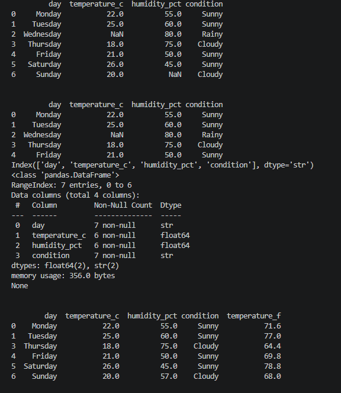
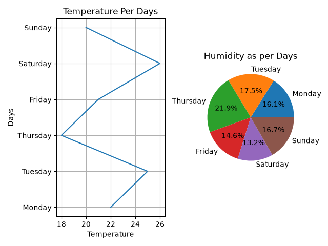

# Weather Data Analysis

This project analyzes weather data using Python, Pandas, and Matplotlib.

Features:
- Load weather data from JSON
- Handle missing values
- Remove invalid records
- Convert temperature from Celsius to Fahrenheit
- Visualize temperature trends
- Visualize humidity distribution

Technologies Used:
- Python
- Pandas
- Matplotlib

Output:
The project generates charts showing temperature and humidity analysis.

## Output

Author:
Harsh Mishra
